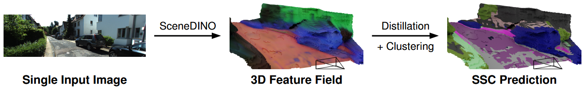

# SceneDINO

[**Paper**](https://arxiv.org/abs/xxxx.xxxxx) | [**Project Page**](https://visinf.github.io/scenedino)

This is the implementation for our following paper.

> **Feed-Forward *SceneDINO* for Unsupervised Semantic Scene Completion** <br>
> [Aleksandar Jevtić](https://www.linkedin.com/in/aleksandar-jevti%C4%87-46998ab2/)\*, [Christoph Reich](https://christophreich1996.github.io/)\*, [Felix Wimbauer](https://fwmb.github.io/), [Oliver Hahn](https://olvrhhn.github.io/), <br>[Christian Rupprecht](https://chrirupp.github.io/), [Stefan Roth](https://www.visinf.tu-darmstadt.de/visual_inference/people_vi/stefan_roth.en.jsp), [Daniel Cremers](https://cvg.cit.tum.de/members/cremers/)
>
> [**arXiv 2025** (arXiv)](https://arxiv.org/abs/xxxx.xxxxx)

⚠️ *NOTE*: Preliminary release version. The code is being cleaned up and documented in the coming weeks.

## 🪧 Overview

### Abstract

Semantic scene completion (SSC) aims to infer both the 3D geometry and semantics of a scene from single images. In contrast to prior work on SSC that heavily relies on expensive ground-truth annotations, we approach SSC in an unsupervised setting. Our novel method, SceneDINO, adapts techniques from self-supervised representation learning and 2D unsupervised scene understanding to SSC. Our training exclusively utilizes multi-view consistency self-supervision without any form of semantic or geometric ground truth. Given a single input image, SceneDINO infers the 3D geometry and expressive 3D DINO features in a feed-forward manner. Through a novel 3D feature distillation approach, we obtain unsupervised 3D semantics. In both 3D and 2D unsupervised scene understanding, SceneDINO reaches state-of-the-art segmentation accuracy. Linear probing our 3D features matches the segmentation accuracy of a current supervised SSC approach. Additionally, we showcase the domain generalization and multi-view consistency of SceneDINO, taking the first steps towards a strong foundation for single image 3D scene understanding.



Given a single input image (_left_), SceneDINO predicts both 3D scene geometry and 3D features in the
form of a feature field (_middle_) in a feed-forward manner, capturing the structure and semantics of the scene. Unsupervised distillation and clustering of SceneDINO’s feature space leads to unsupervised semantic scene completion predictions (_right_).

## 🏗️️ Setup

### 🐍 Python Environment

Our Python environment is managed with **Conda**.

```shell
conda env create -f environment.yml
conda activate scenedino
```

### 💾 Datasets

We provide configuration files for the datasets SceneDINO is trained and evaluated on. Adjust these files and, most importantly, insert the data paths you use.

```bash
configs/dataset/kitti_360_sscbench.yaml
configs/dataset/cityscapes_seg.yaml
configs/dataset/bdd_seg.yaml
configs/dataset/realestate10k.yaml
```

### 📸 Checkpoints

Our pre-trained checkpoints are stored in the CVG webshare. Download one of the checkpoints using the dedicated script.

```bash
# List available models
./download_checkpoint.sh

# Download best model trained on KITTI-360 (SSCBench split)
./download_checkpoint.sh ssc-kitti-360
```

## 🏃 Inference Demo Script

This simple demo script demonstrates loading a model and performing inference in 3D and rendered 2D. It can be used as a starting point to experiment with SceneDINO feature fields.

```bash
python demo_script.py
```

## 🏋 Training

For unsupervised SSC, training is performed in two stages. We provide training configurations in ```configs/``` for each of them. 

**SceneDINO**

First, the 3D feature fields of SceneDINO are trained. 

```bash
python train.py -cn train_scenedino_kitti_360
```

**Unsupervised SSC**

Based on a SceneDINO checkpoint, we train the unsupervised SSC head.

```bash
python train.py -cn train_semantic_kitti_360
```

## 📊 Evaluation

We further provide configurations to reproduce the evaluation results from the paper.

**Unsupervised 2D Segmentation**

```bash
# Unsupervised 2D Segmentation
python eval.py -cn evaluate_semantic_kitti_360
```

**Unsupervised SSC**

```bash
# Unsupervised SSC, adapted from S4C (https://github.com/ahayler/s4c)
python evaluate_model_sscbench.py -ssc <PATH-SSCBENCH> -vgt <PATH-SSCBENCH-LABELS> -cp <PATH-CHECKPOINT>.pt -f -m scenedino -p <RUN-NAME>
```

## 📝 BibTeX

If you find our work useful, please consider citing our paper.
```
@article{Jevtic:2025:SceneDINO,
    author  = {Aleksandar Jevti{\'c} and
                Christoph Reich and
                Felix Wimbauer and
                Oliver Hahn and
                Christian Rupprecht and
                Stefan Roth and
                Daniel Cremers},
    title   = {Feed-Forward {SceneDINO} for Unsupervised Semantic Scene Completion},
    journal = {arXiv:xxxx.xxxxx [cs.CV]},
    year    = {2025},
}
```

## 🗣️ Acknowledgements

This repository is based on the [Behind The Scenes (BTS)](https://github.com/Brummi/BehindTheScenes) code base.
